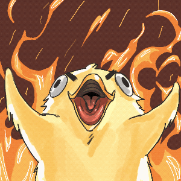

<div align="center">



# 🐍 SNAKE ARENA

### **NO CONTROLLERS. JUST YOUR HAND.**

> *Point. Slither. Dominate.*

**ENTER THE ARENA — where the only input device is your bare hand and the will to win.**

<br>

[](https://pietrosaveri.github.io/FingerSnake-Arena/)

<br>

[](https://developers.google.com/mediapipe)
[](https://vitejs.dev)
[](https://supabase.com)

</div>

---

## 🎮 What is this?

This is not your childhood Snake.

**SnakeArena** is a browser-based Snake game where your **index and middle fingers ARE the controller**. Point up, the snake goes up. Point right, it goes right. No keyboard. No mouse. No excuses.

Under the hood, your webcam feeds live frames into a **MediaPipe hand-tracking pipeline** that reads the angle between your wrist and fingertip in real time, and maps it directly to snake direction. The arena updates every 180 ms. Think fast. Point faster.

Built for **competitive play** with a global leaderboard. One screen, one camera, zero mercy.
---

## ⚡ Features

| | |
|---|---|
| 🖐️ **Gesture Control** | Point to steer, no keyboard, no mouse, no gamepad |
| 🐍 **Real-time Snake** | Smooth movement at a locked 180 ms step rate |
| 🏟️ **Arena UI** | Full-screen canvas, screen shake on death, hype sound effects |
| 🔥 **Visual Effects** | Particle bursts, shake animations, dramatic game-over screen |
| 🧠 **MediaPipe Vision** | Hand landmark detection running right in your browser via WASM |
| 🏆 **Global Leaderboard** | Powered by Supabase, submit your best score, chase the top |
| 🎵 **Sound Engine** | Web Audio API sound effects on eat, death, and navigation |
| 📷 **Mirror View** | Camera feed is flipped so pointing YOUR right = snake goes RIGHT |

---

## 🧠 How It Works

<div align="center">

</div>

Here's the pipeline, simplified:

```
Webcam frame
    │
    ▼
Flip horizontally (mirror view)
    │
    ▼
MediaPipe HandLandmarker (WASM, runs in-browser)
    │  detects 21 hand landmarks per frame
    ▼
Compute angle: wrist → index+middle fingertip vector
    │  using atan2(dy, dx) in degrees
    ▼
EMA smoothing + hysteresis + streak filter (2 consecutive frames)
    │  prevents jittery direction flips
    ▼
Direction: UP / DOWN / LEFT / RIGHT
    │
    ▼
Snake game loop (180 ms tick)
```

**Key details:**
- The model runs entirely client-side via `@mediapipe/tasks-vision` — no server, no latency
- Direction uses a **streak system**: a direction must be confirmed across **2 consecutive frames** before it's applied, killing jitter
- An **EMA (Exponential Moving Average)** smooths the pointing angle over time
- LEFT/RIGHT get a slight angular bias since horizontal gestures are naturally wider

---

## ⚠️ DISCLAIMER (READ THIS)

To all the “funny” hackers and cybersecurity experts:
YES, the anon key and URL are in the project (intentionally).
And yes, you can use them… but only to read data and submit new scores.
So if you really want to spend time digging them up and playing with that… you can.
Just remember: this is a simple game, and doing that doesn’t really prove anything.

This note exists for the people saying “you vibe-coded this and don’t know shit”
I know exactly where the key is, how it can be found, and how it can be used.
It’s fine. Do whatever you want, if you really feel the need to.

---

## 🛠️ Tech Stack

| Layer | Tech |
|---|---|
| Frontend | Vanilla JS + Vite |
| Hand Tracking | MediaPipe Tasks Vision (`@mediapipe/tasks-vision`) |
| Game Logic | Custom JS Snake engine |
| Leaderboard | Supabase (PostgreSQL + RLS) |
| Deployment | GitHub Pages via `gh-pages` |
| Python prototype | OpenCV + MediaPipe + Pygame |

---

<div align="center">

*Built with a webcam, a lot of MediaPipe docs, and an unhealthy amount of competitive energy.*

**ENTER THE ARENA.**


</div>
